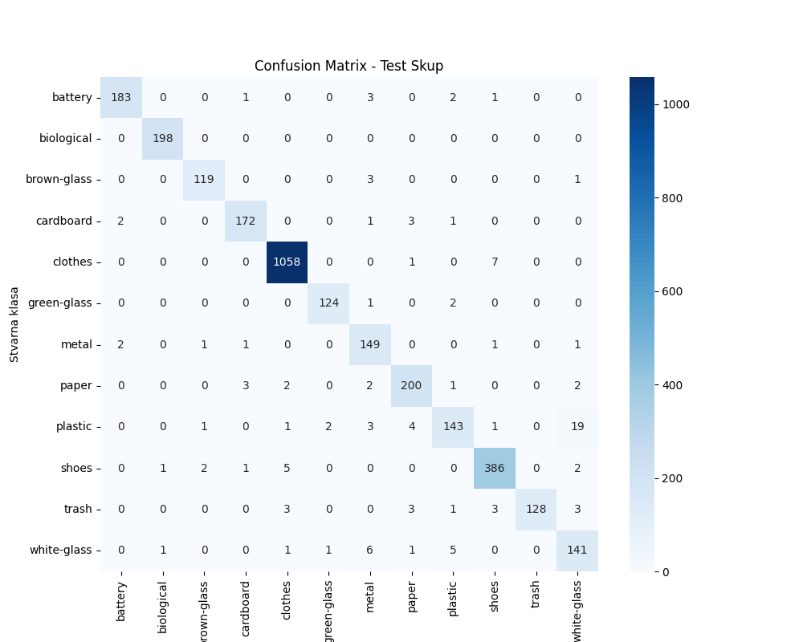

# klasifikacija-otpada-za-reciklazu

## Struktura projekta

```bash
klasifikacija-otpada-za-reciklazu/
├── data/
│ ├── raw/
│ │     ├── battery/
│ │     ├── biological/
│ │     ├── brown-glass/
│ │     ├── cardboard/
│ │     ├── clothes/
│ │     ├── green-glass/
│ │     ├── metal/
│ │     ├── paper/
│ │     ├── plastic/
│ │     ├── shoes/
│ │     ├── trash/
│ │     └── white-glass/
│ └── processed/
│      ├── test/
│      ├── train/
│      └── val/
├── models/
│    ├── best_model.keras
│    ├── model_metrics.csv
│    ├── model.keras
│    ├── test_results.png
│    ├── training_log.csv
├── src/
│    ├── config.py
│    ├── predict.py
│    ├── split_data.py
│    ├── test.py
│    ├── train.py
├── README.md
├── requirements.txt
```

## Pokretanje projekta

1. Kloniranje repozitorijuma:

```bash
   git clone https://github.com/SStjepic/klasifikacija-otpada-za-reciklazu.git
   cd klasifikacija-otpada-za-reciklazu/
```

2. Kreiranje virtuelnog oktuženja

```bash
    python -m venv venv
    # Linux/Mac:
    source venv/bin/activate
    # Windows:
    venv\Scripts\activate
```

3. Instaliranje potrebnih zavisnosti

```bash
    pip install -r requirements.txt
```

## Skup podataka

Skup podataka je preuzet sa sajta **Kaggle**.
**Kaggle URL:** [Garbage Classification (12 classes)](https://www.kaggle.com/datasets/stefanstjepic/serbian-banknotes)

Neophodno je preuzeti skup podataka sa sajta, raspakovati ga i ubaciti u folder data tako da odgovara strukturi projekta.
Nakon toga, pokrenite skriptu koja ce podeliti podatke na train:test:val u razmeri 70:20:10.

```bash
    cd src
    python split_data.py
```

Unutar _data/_ foldera kreiraće se podfolder _processed_ koji će imati tri podfoldera _test_, _train_ i _val_. Unutar ovih foldera će se nalaziti slike podeljenje u 12 foldera koje će imati iste nazive kao i folderi u unutar _data/raw/_.

## Treniranje modela

Pre samog pokretanja skripte za treniranje modela, potrebno je unutar \_config.py_fajla definisati neophodne promenljive.

```bash
IMG_SIZE = (224, 224)
BATCH_SIZE = 16
EPOCHS = 30


DATA_PATH = '../data/processed'
TRAIN_PATH = f"{DATA_PATH}/train"
VAL_PATH = f"{DATA_PATH}/val"
TEST_PATH = f"{DATA_PATH}/test"

MODELS_PATH = '../models'
BEST_MODEL_PATH = f"{MODELS_PATH}/best_model.keras"
FINAL_MODEL_PATH = f"{MODELS_PATH}/model.keras"

MODEL_METRICS = f"{MODELS_PATH}/model_metrics.csv"
```

Nakon definasana promenljivih, može se pokrenuti skripta za treniranje.
Pozicioniramo se unutar _src/_ foldera i pokrećemo skriptu _train.py_.

```bash
    cd src
    python train.py
```

## Evaluacija

Posle uspešno završenog treniga, možemo izvršiti evaluaciju modela.
Pozicioniramo se unutar _src/_ foldera i pokrećemo skriptu _test.py_.
Sama evaluacija se vrši nad test skupom podataka koga čini 3116 slika podeljenih u 12 kategorija.

```bash
    cd src
    python test.py
```

Nakon izvršavanja skripte _test.py_, generiše se klasifikacioni izveštaj koji sadrži metrike Precision, Recall, F1-score, Accuracy i Support za svaku klasu, kao i agregirane (macro i weighted) proseke.

```bash
                  precision  recall  f1-score   support
    battery           0.979   0.963     0.971   190.000
    biological        0.990   1.000     0.995   198.000
    brown-glass       0.967   0.967     0.967   123.000
    cardboard         0.966   0.961     0.964   179.000
    clothes           0.989   0.992     0.991  1066.000
    green-glass       0.976   0.976     0.976   127.000
    metal             0.887   0.961     0.923   155.000
    paper             0.943   0.952     0.948   210.000
    plastic           0.923   0.822     0.869   174.000
    shoes             0.967   0.972     0.970   397.000
    trash             1.000   0.908     0.952   141.000
    white-glass       0.834   0.904     0.868   156.000

    accuracy          0.963   0.963     0.963     0.963
    macro avg         0.952   0.948     0.949  3116.000
    weighted avg      0.964   0.963     0.963  3116.000
```

**Confusion matrix**


Model je postigao ukupnu tačnost od 96.3% na test skupu od 3116 slika.
Najslabije performanse zabeležene su kod klasa plastic i white-glass, dok su najbolje performanse ostvarene kod klasa biological i clothes.

## Upotreba

Pokretanjem skripte _predict.py_ pokreće se konzolna aplikacija. Potrebno je uneti apsolutnu putanju do slike i kao odgovor se dobije
predikcija modela kao i pouzdanost modela u tačnost predikcije.

```bash
    cd src
    python predict.py

    # primer
    ========================================
    Unesite putanju do slike (ili 'exit' za izlaz): D:\slika_metala.jpg
    ----------------------------------------
    PREDIKCIJA: METAL
    POUZDANOST: 95.12%
    ----------------------------------------
```
